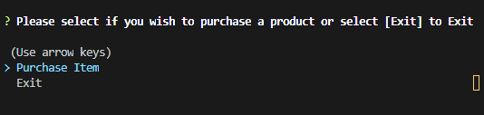
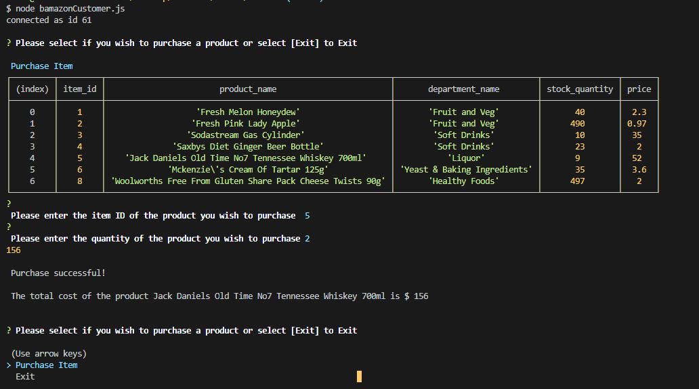
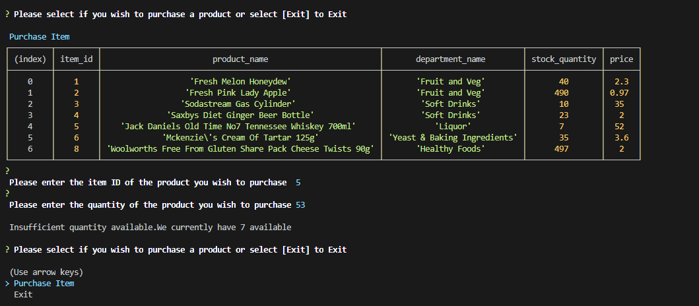

# bamazon
* An Amazon-like storefront. The app will take in orders from customers and deplete stock from the store's inventory.
T
## HOW TO USE
* Create the database schema using "schema.sql"
* Add the data using data from"data.sql".

   **Note: I have assumed you are already familar with mysql creation and usage"**
   * Clone this repo and create a .env file and add the following "password='your database password'"
   * Run "npm i" to download mysql and inquirer packages.

 ## **bamazonCustomer**
 The app should then prompt users with two messages.

   * The first will ask them the ID of the product they would like to buy.
   * The second message will prompt for quantity of the product.
    
 Once the customer has placed the order, The application will check if your store has enough of the product to meet the customer's request.

     Once the update goes through, The customer will see the total cost of their purchase.

   * If not, the app will output  `Insufficient quantity available.We currently have "selected item stock " available`, and then prevent the order from going through.

    However, if the store _does_ have enough of the product, the app will fulfill the customer's order.

   
 ## **bamazonManager**
 

 * If a manager selects `View Products for Sale`, the app will list every available item: the item IDs, names, prices, and quantities.

  * If a manager selects `View Low Inventory`, then it will list all items with an inventory count lower than five.

  * If a manager selects `Add to Inventory`, The app will display a prompt that will let the manager "add more" of any item currently in the store.

  * If a manager selects `Add New Product`, The app will allow the manager to add a completely new product to the store.

  

 ## **bamazonSupervisor**
 Running this application will list a set of menu options:

 
 
   * View Product Sales by Department
   
   When a supervisor selects `View Product Sales by Department`, the app will display a summarized table in their terminal/bash window
 showing the department_id,department_name,over_head_costs,product_sales and total_profit by department

  
   * Create New Department
   
   When a supervisor selects `Create New Department`, The app will prompt the user to add the department name and over head costs.

   
   

  
  
